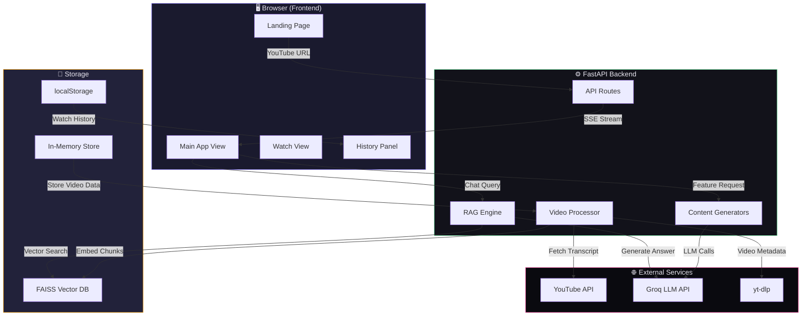
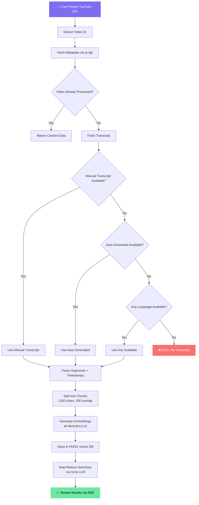
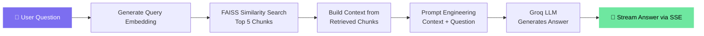
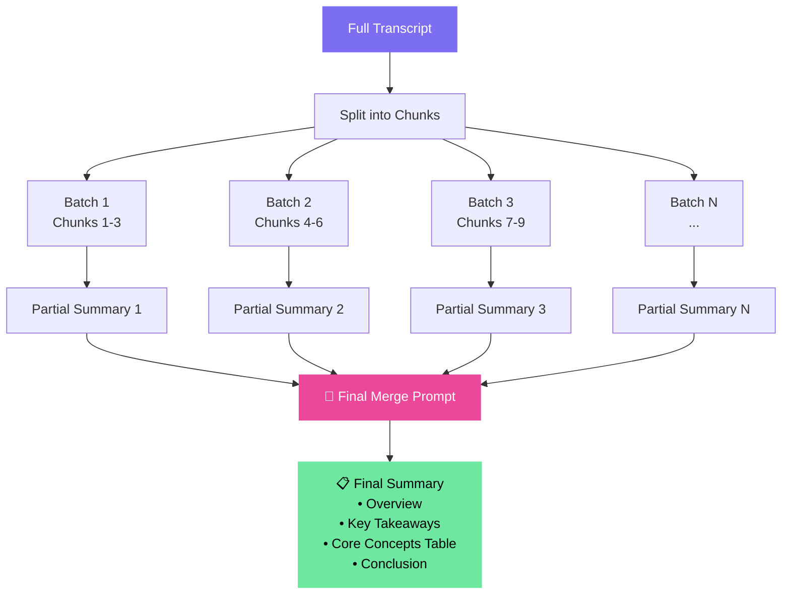
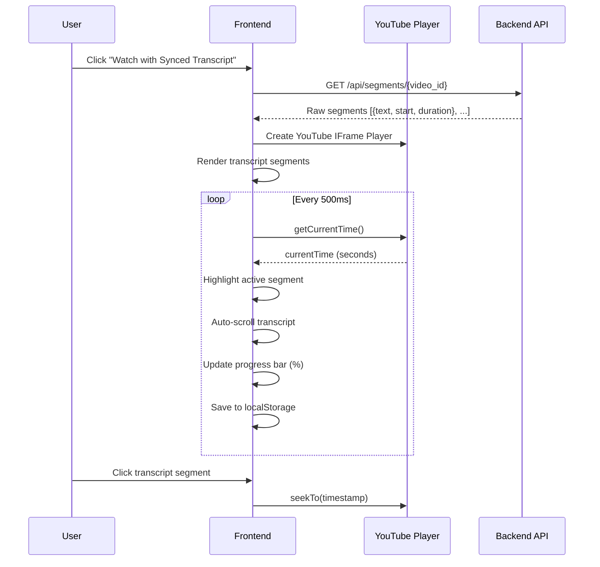
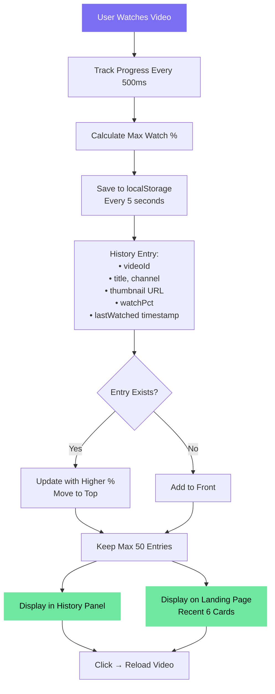
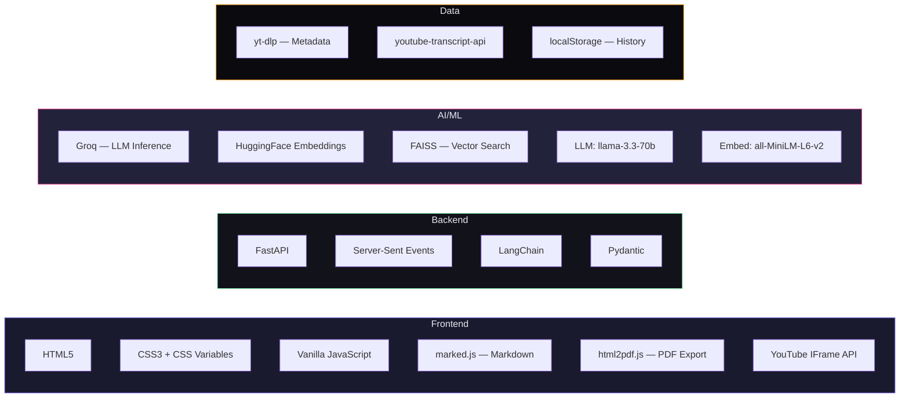
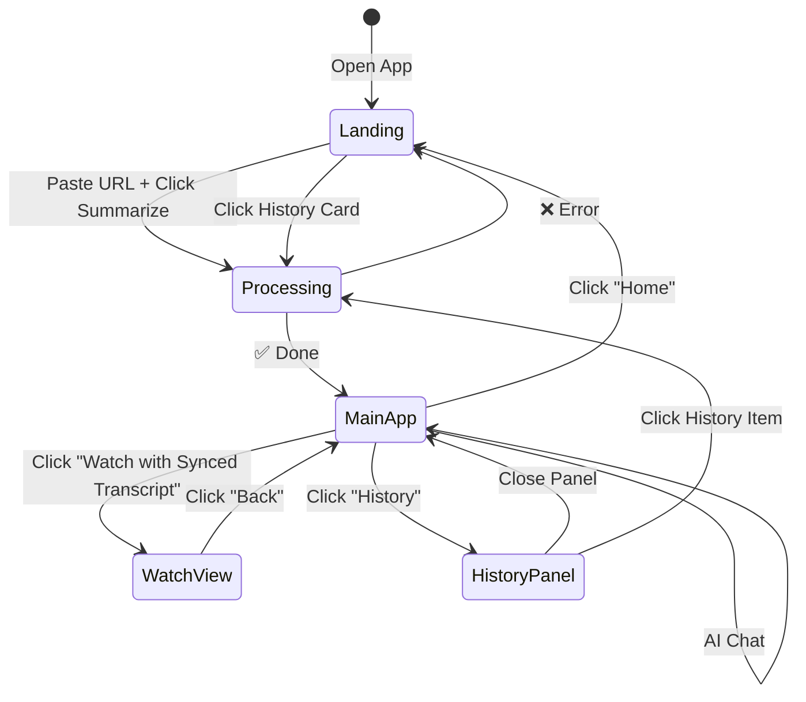

<p align="center">
  
  
  
  
  
</p>

<h1 align="center">🎬 YouTube Video Summarizer</h1>
<h3 align="center">Agentic RAG-Powered • Real-Time Streaming • AI Chat with Videos</h3>

<p align="center">
  Paste any YouTube link → Get AI summaries, chapters, mind maps, study notes, synced transcript playback, and chat with your video — all in real-time.
</p>

---

## 🌟 Features at a Glance

| Feature | Description |
|---------|-------------|
| 📝 **AI Summary** | Map-Reduce style detailed summary with key takeaways |
| 📚 **Chapters** | Auto-generated chapter breakdown with time estimates |
| 🧠 **Key Concepts** | Extracted concepts, terms & people as a table |
| 🗺️ **Mind Map** | Hierarchical mind map of video content |
| 📒 **Study Notes** | Structured notes ready for revision |
| 💬 **AI Chat (RAG)** | Ask any question — answers from the video transcript |
| ▶️ **Watch + Synced Transcript** | Video player with live-highlighted transcript |
| 📊 **Watch Progress** | Track how much of the video you've watched (%) |
| 🕐 **Watch History** | Persistent history of all watched videos |
| 📄 **Export PDF** | Export any content as a formatted PDF |
| 🌓 **Dark / Light Mode** | Full theme support |

---

## 🏗️ System Architecture



---

## 🔄 Video Processing Pipeline

This is the core flow when a user pastes a YouTube URL and hits "Summarize":



---

## 🤖 RAG (Retrieval-Augmented Generation) Flow

When a user asks a question in the AI Chat:



---

## 📝 Map-Reduce Summarization

The summary is generated using an agentic Map-Reduce pattern:



---

## ▶️ Watch View — Synced Transcript



---

## 🕐 Watch History System



---

## 📂 Project Structure

```
📁 YouTube-Summarizer/
├── 📄 main.py                  # FastAPI backend — all routes, RAG, LLM logic
├── 📄 requirements.txt         # Python dependencies
├── 📄 render.yaml              # Render deployment config
├── 📄 .env                     # API keys (not in git)
├── 📄 .gitignore
├── 📁 templates/
│   └── 📄 index.html           # Full frontend — single page app
├── 📁 extra-files/             # Runtime files (FAISS index, etc.)
└── 📁 __pycache__/             # Python cache (ignored)
```

---

## 🛠️ Tech Stack



---

## 🚀 Quick Start

### Prerequisites
- Python 3.10+
- [Groq API Key](https://console.groq.com/) (free)

### 1. Clone & Install

```bash
git clone https://github.com/divye07/SWE-Proj.git
cd SWE-Proj
pip install -r requirements.txt
```

### 2. Configure Environment

Create a `.env` file:

```env
GROQ_API_KEY=your_groq_api_key_here
```

### 3. Run

```bash
python main.py
```

Open **http://localhost:8000** in your browser. 🎉

---

## 🌐 API Endpoints

| Method | Endpoint | Description |
|--------|----------|-------------|
| `GET` | `/` | Serve the frontend |
| `POST` | `/api/process` | Process a YouTube video (SSE stream) |
| `POST` | `/api/chat` | RAG-based Q&A chat (SSE stream) |
| `POST` | `/api/feature` | Generate summary/chapters/concepts/mindmap/notes (SSE stream) |
| `GET` | `/api/segments/{video_id}` | Get raw transcript segments for synced playback |

### Request/Response Examples

<details>
<summary><b>POST /api/process</b></summary>

**Request:**
```json
{ "url": "https://www.youtube.com/watch?v=dQw4w9WgXcQ" }
```

**SSE Events:**
```
event: progress
data: {"step": "metadata", "message": "Fetching video info..."}

event: metadata
data: {"video_id": "dQw4w9WgXcQ", "title": "...", "channel": "...", ...}

event: progress
data: {"step": "summary", "message": "Generating summary..."}

event: complete
data: {"video_id": "...", "transcript": "...", "summary": "...", ...}
```
</details>

<details>
<summary><b>POST /api/chat</b></summary>

**Request:**
```json
{ "video_id": "dQw4w9WgXcQ", "message": "What is the main topic?" }
```

**SSE Events:**
```
event: answer
data: {"text": "The main topic of this video is..."}
```
</details>

---

## 🖼️ UI Flow



---

## 📦 Deployment (Render)

This project includes a `render.yaml` for one-click deployment:

1. Push to GitHub
2. Go to [render.com](https://render.com) → **New Web Service**
3. Connect your repo
4. Add environment variables: `GROQ_API_KEY`
5. Deploy! 🚀

**Start Command:** `uvicorn main:app --host 0.0.0.0 --port $PORT`

---

## 🔒 Security

- API keys stored in `.env` (excluded from git via `.gitignore`)
- No user data stored on server — watch history is client-side only (localStorage)
- Input validation via Pydantic models
- HTML escaping for all user-facing content

---

## 👨‍💻 Author

**Divye** — [GitHub](https://github.com/divye07)

---

<p align="center">
  <b>⭐ Star this repo if you found it useful!</b>
</p>
