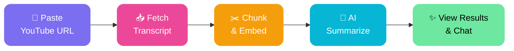
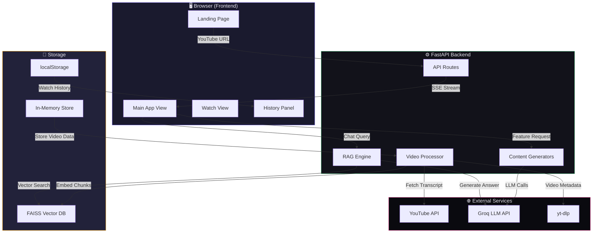
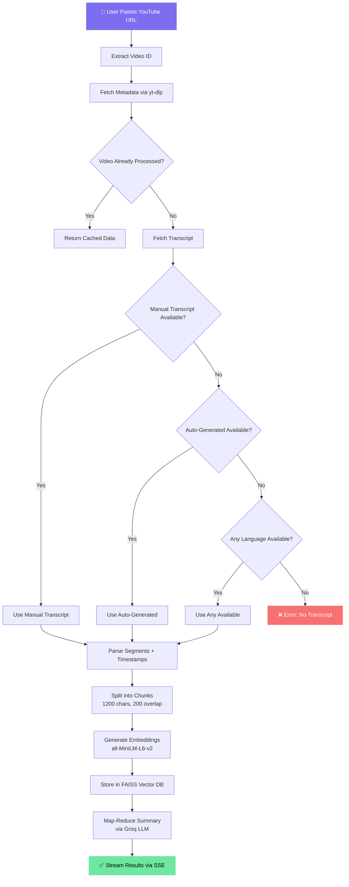
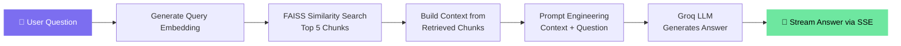
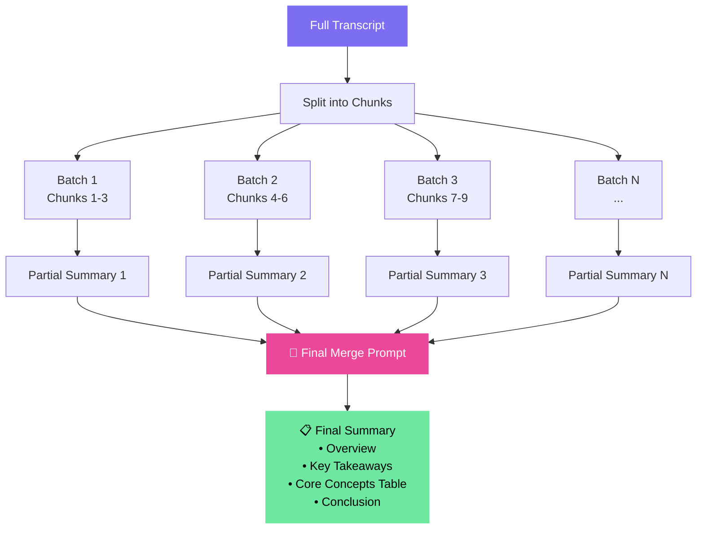
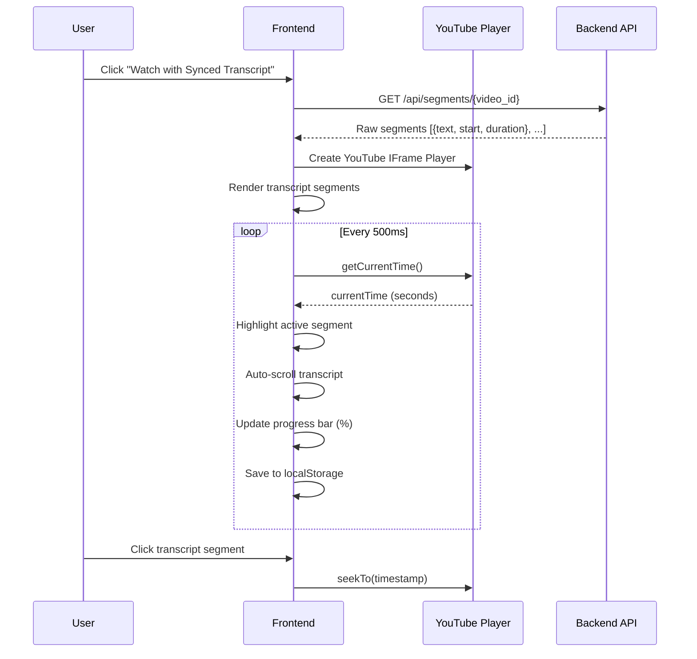
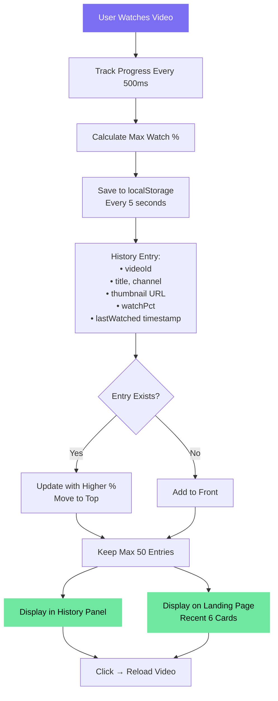
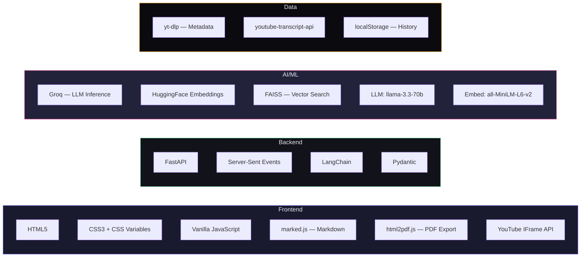
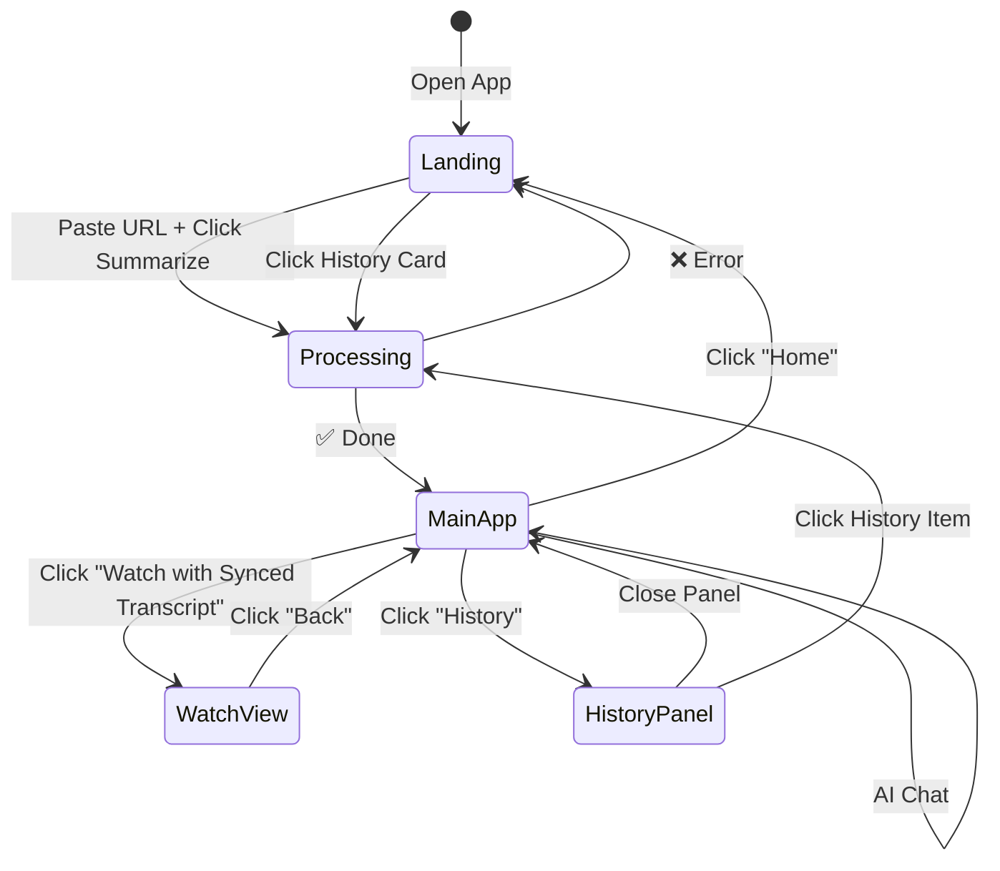
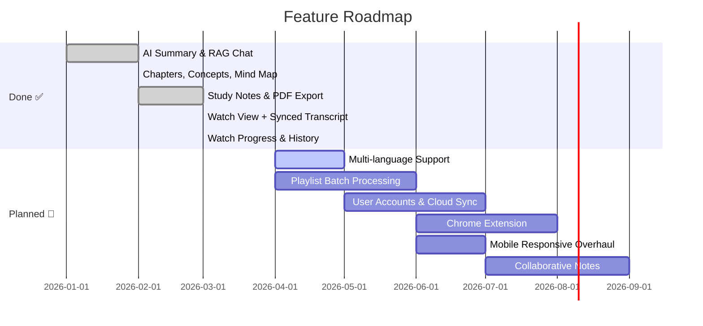

<p align="center">
  
  
  
  
  
</p>

<h1 align="center">🎬 YouTube Video Summarizer</h1>
<h3 align="center">Agentic RAG-Powered • Real-Time Streaming • AI Chat with Videos</h3>

<p align="center">
  Paste any YouTube link → Get AI summaries, chapters, mind maps, study notes, synced transcript playback, and chat with your video all in real-time.
</p>

---

## 📑 Table of Contents

- [📑 Table of Contents](#-table-of-contents)
- [� Demo](#-demo)
- [🌟 Features at a Glance](#-features-at-a-glance)
- [⚡ How It Works (Simple)](#-how-it-works-simple)
- [🏗️ System Architecture](#️-system-architecture)
- [🔄 Video Processing Pipeline](#-video-processing-pipeline)
- [🤖 RAG (Retrieval-Augmented Generation) Flow](#-rag-retrieval-augmented-generation-flow)
- [📝 Map-Reduce Summarization](#-map-reduce-summarization)
- [▶️ Watch View — Synced Transcript](#️-watch-view--synced-transcript)
- [🕐 Watch History System](#-watch-history-system)
- [📂 Project Structure](#-project-structure)
- [🛠️ Tech Stack](#️-tech-stack)
- [⚡ Performance](#-performance)
- [🚀 Quick Start](#-quick-start)
  - [Prerequisites](#prerequisites)
  - [1. Clone \& Install](#1-clone--install)
  - [2. Configure Environment](#2-configure-environment)
  - [3. Run](#3-run)
- [🌐 API Endpoints](#-api-endpoints)
  - [Request/Response Examples](#requestresponse-examples)
- [🖼️ UI Flow](#️-ui-flow)
- [📦 Deployment (Render)](#-deployment-render)
- [🔒 Security](#-security)
- [❓ FAQ](#-faq)
- [🗺️ Roadmap](#️-roadmap)
- [🤝 Contributing](#-contributing)
  - [Development Setup](#development-setup)
- [📄 License](#-license)
- [👨‍💻 Author](#-author)

---

## � Demo

<p align="center">
  <i>📸 Screenshots coming soon — run locally to see the full experience!</i>
</p>

> **Landing Page** → Paste URL → **Processing Screen** → **Main Dashboard** with Summary, Chapters, Mind Map, Notes, Transcript, AI Chat → **Watch View** with synced transcript → **History Panel**

---

## �🌟 Features at a Glance

| Feature | Description |
|---------|-------------|
| 📝 **AI Summary** | Map-Reduce style detailed summary with key takeaways |
| 📚 **Chapters** | Auto-generated chapter breakdown with time estimates |
| 🧠 **Key Concepts** | Extracted concepts, terms & people as a table |
| 🗺️ **Mind Map** | Hierarchical mind map of video content |
| 📒 **Study Notes** | Structured notes ready for revision |
| 💬 **AI Chat (RAG)** | Ask any question — answers from the video transcript |
| ▶️ **Watch + Synced Transcript** | Video player with live-highlighted transcript |
| 📊 **Watch Progress** | Track how much of the video you've watched (%) |
| 🕐 **Watch History** | Persistent history of all watched videos |
| 📄 **Export PDF** | Export any content as a formatted PDF |
| 🌓 **Dark / Light Mode** | Full theme support |

---

## ⚡ How It Works (Simple)



**5 simple steps:**

1. **Paste** any YouTube URL
2. **Transcript** is fetched instantly via YouTube's API (supports English & Hindi)
3. **Chunked** into overlapping segments and embedded into a FAISS vector database
4. **AI summarizes** using Map-Reduce over Groq's blazing-fast LLM
5. **Explore** — read summaries, watch with synced transcript, chat with RAG, export PDF

---

## 🏗️ System Architecture



---

## 🔄 Video Processing Pipeline

This is the core flow when a user pastes a YouTube URL and hits "Summarize":



---

## 🤖 RAG (Retrieval-Augmented Generation) Flow

When a user asks a question in the AI Chat:



---

## 📝 Map-Reduce Summarization

The summary is generated using an agentic Map-Reduce pattern:



---

## ▶️ Watch View — Synced Transcript



---

## 🕐 Watch History System



---

## 📂 Project Structure

```
📁 YouTube-Summarizer/
├── 📄 main.py                  # FastAPI backend — all routes, RAG, LLM logic
├── 📄 requirements.txt         # Python dependencies
├── 📄 render.yaml              # Render deployment config
├── 📄 .env                     # API keys (not in git)
├── 📄 .gitignore
├── 📁 templates/
│   └── 📄 index.html           # Full frontend — single page app
├── 📁 extra-files/             # Runtime files (FAISS index, etc.)
└── 📁 __pycache__/             # Python cache (ignored)
```

---

## 🛠️ Tech Stack



---

## ⚡ Performance

| Metric | Value |
|--------|-------|
| **Transcript Fetch** | ~1-2 seconds (YouTube API) |
| **Embedding** (avg video) | ~3-5 seconds |
| **Summary Generation** | ~5-10 seconds |
| **RAG Chat Response** | ~2-3 seconds |
| **Total Processing** | ~15-25 seconds (end-to-end) |
| **Embedding Model** | all-MiniLM-L6-v2 (384 dims) |
| **LLM** | Groq-hosted (ultra-fast inference) |
| **Chunk Size** | 1200 chars, 200 overlap |
| **Vector Search** | Top-5 similarity (FAISS) |

> 💡 Groq provides the fastest LLM inference available — responses are near-instant compared to traditional cloud LLMs.

---

## 🚀 Quick Start

### Prerequisites
- Python 3.10+
- [Groq API Key](https://console.groq.com/) (free)

### 1. Clone & Install

```bash
git clone https://github.com/divye07/SWE-Proj.git
cd SWE-Proj
pip install -r requirements.txt
```

### 2. Configure Environment

Create a `.env` file:

```env
GROQ_API_KEY=your_groq_api_key_here
```

### 3. Run

```bash
python main.py
```

Open **http://localhost:8000** in your browser. 🎉

---

## 🌐 API Endpoints

| Method | Endpoint | Description |
|--------|----------|-------------|
| `GET` | `/` | Serve the frontend |
| `POST` | `/api/process` | Process a YouTube video (SSE stream) |
| `POST` | `/api/chat` | RAG-based Q&A chat (SSE stream) |
| `POST` | `/api/feature` | Generate summary/chapters/concepts/mindmap/notes (SSE stream) |
| `GET` | `/api/segments/{video_id}` | Get raw transcript segments for synced playback |

### Request/Response Examples

<details>
<summary><b>POST /api/process</b></summary>

**Request:**
```json
{ "url": "https://www.youtube.com/watch?v=dQw4w9WgXcQ" }
```

**SSE Events:**
```
event: progress
data: {"step": "metadata", "message": "Fetching video info..."}

event: metadata
data: {"video_id": "dQw4w9WgXcQ", "title": "...", "channel": "...", ...}

event: progress
data: {"step": "summary", "message": "Generating summary..."}

event: complete
data: {"video_id": "...", "transcript": "...", "summary": "...", ...}
```
</details>

<details>
<summary><b>POST /api/chat</b></summary>

**Request:**
```json
{ "video_id": "dQw4w9WgXcQ", "message": "What is the main topic?" }
```

**SSE Events:**
```
event: answer
data: {"text": "The main topic of this video is..."}
```
</details>

---

## 🖼️ UI Flow



---

## 📦 Deployment (Render)

This project includes a `render.yaml` for one-click deployment:

1. Push to GitHub
2. Go to [render.com](https://render.com) → **New Web Service**
3. Connect your repo
4. Add environment variables: `GROQ_API_KEY`
5. Deploy! 🚀

**Start Command:** `uvicorn main:app --host 0.0.0.0 --port $PORT`

---

## 🔒 Security

- API keys stored in `.env` (excluded from git via `.gitignore`)
- No user data stored on server — watch history is client-side only (localStorage)
- Input validation via Pydantic models
- HTML escaping for all user-facing content

---

## ❓ FAQ

<details>
<summary><b>Q: Does it work with any YouTube video?</b></summary>

It works with any video that has subtitles/captions (manual or auto-generated). Most English and Hindi videos have auto-generated captions enabled by YouTube.
</details>

<details>
<summary><b>Q: Is it free to use?</b></summary>

Yes! Groq offers a generous free tier. The embedding model runs locally. No paid APIs required.
</details>

<details>
<summary><b>Q: Can I use it for videos in other languages?</b></summary>

Currently optimized for English and Hindi transcripts. If a video has captions in another language, it will still attempt to use them.
</details>

<details>
<summary><b>Q: Where is watch history stored?</b></summary>

Watch history is stored in your browser's localStorage — nothing is sent to any server. Clearing browser data will reset it.
</details>

<details>
<summary><b>Q: Why is the summary taking long?</b></summary>

Longer videos produce more chunks, which means more LLM calls during Map-Reduce summarization. Groq is already the fastest — typical videos process in 15-25 seconds.
</details>

<details>
<summary><b>Q: Can I deploy this for free?</b></summary>

Yes! Render.com offers a free tier that's perfect for this app. See the <a href="#-deployment-render">Deployment</a> section.
</details>

---

## 🗺️ Roadmap



**Coming Next:**
- 🌍 Multi-language transcript support (auto-translate)
- 📋 Playlist batch processing — summarize entire playlists
- 👤 User accounts with cloud-synced history
- 🧩 Chrome extension — summarize directly from YouTube
- 📱 Full mobile-responsive redesign
- 👥 Collaborative notes & shared summaries

---

## 🤝 Contributing

Contributions are welcome! Here's how:

1. **Fork** the repository
2. **Create** a feature branch: `git checkout -b feature/amazing-feature`
3. **Commit** your changes: `git commit -m 'Add amazing feature'`
4. **Push** to the branch: `git push origin feature/amazing-feature`
5. **Open** a Pull Request

### Development Setup

```bash
git clone https://github.com/divye07/SWE-Proj.git
cd SWE-Proj
pip install -r requirements.txt
# Add your .env file with GROQ_API_KEY
python main.py
# App runs on http://localhost:8000 with hot-reload
```

---

## 📄 License

**⚠️ All Rights Reserved** — This project is proprietary. No part of this software may be copied, modified, distributed, or used without explicit written permission from the author. See [LICENSE](LICENSE) for full terms.

---

## 👨‍💻 Author

**Divye** — [GitHub](https://github.com/divye07)

---

<p align="center">
  <b>⭐ Star this repo if you found it useful!</b>
</p>
